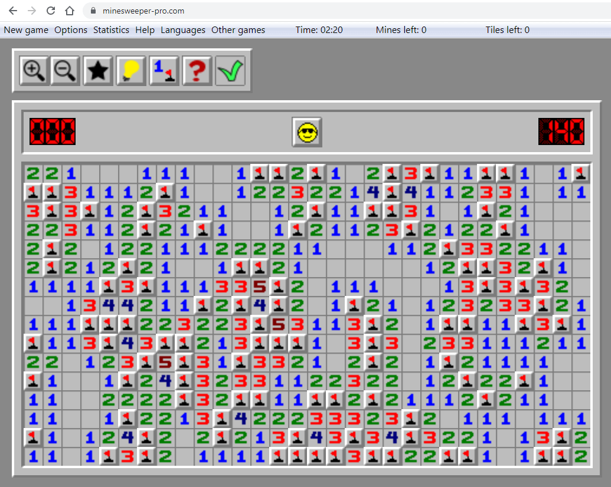

## Learning to See Patterns in Minesweeper

I’ve been playing Minesweeper for two years. It’s a simple game that I can play anywhere and constantly get better at. At first, the game was extremely difficult. It was a guessing game; I clicked randomly, just hoping I wouldn’t lose. But then, I slowly started to recognize patterns starting from the most obvious ones, like a “1” touching just one hidden square. The more I played, the faster my brain recognized these patterns. Furthermore, I would even recognize more complex patterns based on the basic ones. Overall, I stopped guessing and started reasoning. Minesweeper became a game of logic rather than guessing.

## From Guessing to Logical Thinking

Since I started developing software in college, I’ve realized that it has a lot of parallels with Minesweeper. Early on, every feature feels like its own puzzle. I wrote things from scratch and hoped there were no errors. But as I kept going, familiar shapes started to appear, along with tasks that utilized solutions from my previous work. I started to realize I don’t always need to invent a solution; I just need to recognize patterns. That’s what design patterns are. They’re the Minesweeper logic of software; repeated clues in different forms. The “Observer” pattern shows up when one change needs to ripple through different parts of your app, like notifications or live updates. The “Singleton” is like realizing there’s only ever one bomb in a certain spot; there’s no need to keep checking. It’s just there, managing something global, like for example, a login session.

## Discovering Patterns Through Experience

I didn’t learn them all from a book. In one project, I kept creating new login objects for each page until things broke. Later, I looked up how to keep just one session active and found the answer: a shared instance. It worked, and that’s when I realized I had used the Singleton pattern without even knowing it. In another project, I had different types of users needing slightly different behavior. Instead of loading the code with “if user is admin, do this,” I broke it up into separate classes. That’s the Strategy pattern. Again, I didn’t call it that at the time, but I was using it.

## Why These Patterns Matter

Through experience, I learned that design patterns aren’t magic tricks. They’re just ways to solve problems that have already been solved before. Like Minesweeper patterns, they help you take what looks complicated and make it manageable. Once you see them, you never go back to guessing and you become much faster.

AI (ChatGPT) assisted in writing this essay by making the titles and headers.
