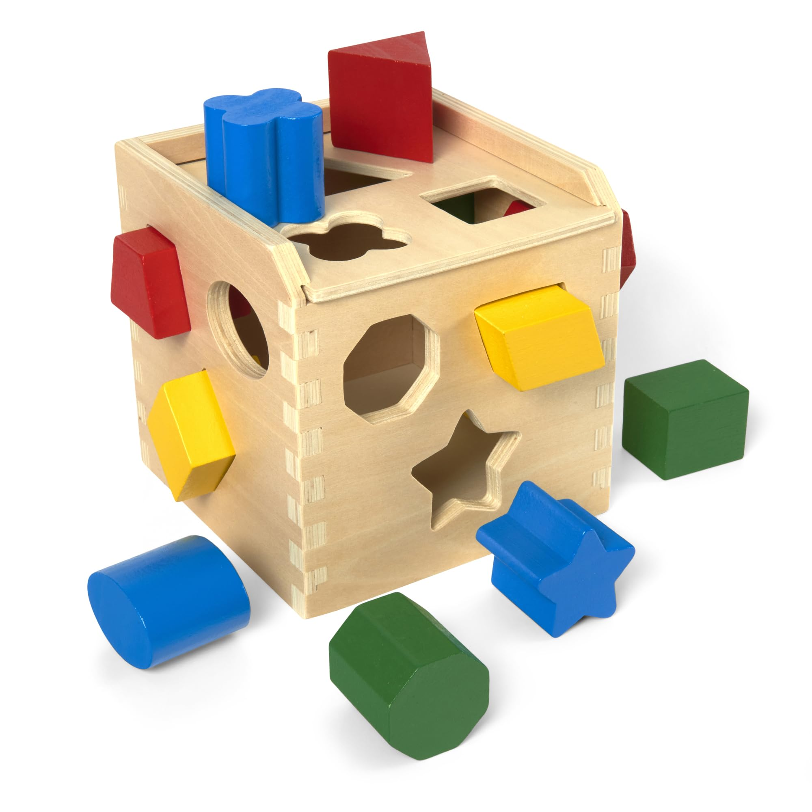

## The Play

When people talk about their passion, they often explain that their interest was sparked very early on in their life or how they were inspired to follow a family member’s footsteps. In my case, however, it all started on a computer game when I was in elementary school. My first experience with programming was not explicitly programming; it was creating levels in the game Happy Wheels. This popular Unity browser game from a decade ago was a game of endless possibilities, with players being able to design and share custom levels. As a kid with no concept of time, I dove right into the rabbithole. Designing levels involved working with triggers, conditionals, and loops; all without realizing it was programming. It was my first encounter with logical thinking, and though I did not recognize it back then, it planted the seed that would guide me to where I am today.

## The Purpose

With those early experiences in my back pocket, I naturally gravitated towards a deeper interest in computer science throughout my time in school. I was fortunate to have attended a school district that emphasized hands-on learning, which kept me engaged. In my coding classes, we were assigned to work on real-world projects, participate in competitions, and connect with industry professionals. One of my proudest moments came in 2021 when I earned second place at the Hawaii Annual Code Challenge. Collaborating with two teammates, we built a chatbot for the Office of Hawaiian Affairs. It was my first time being recognized in this field, and it not only validated my passion but also inspired me to explore other areas of the field like AI and web development.

More recently, I’ve had the opportunity to further my skills as one of the founding members of Haumana Exchange, a team specializing in creating software-based solutions. In just a few months, we’ve built a student marketplace, placed second in the 2024 Hawaii Annual Code Challenge, and are now developing a web and mobile application for a real estate startup. Each project has challenged me in new ways, and I’ve been able to grow as both a developer and a collaborator. 

Looking back, I never would have guessed that mindlessly creating obstacle courses in Happy Wheels would lead me to where I am today, but it shows that inspiration can come from unexpected places.
