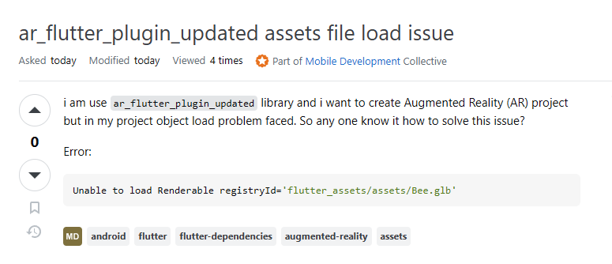
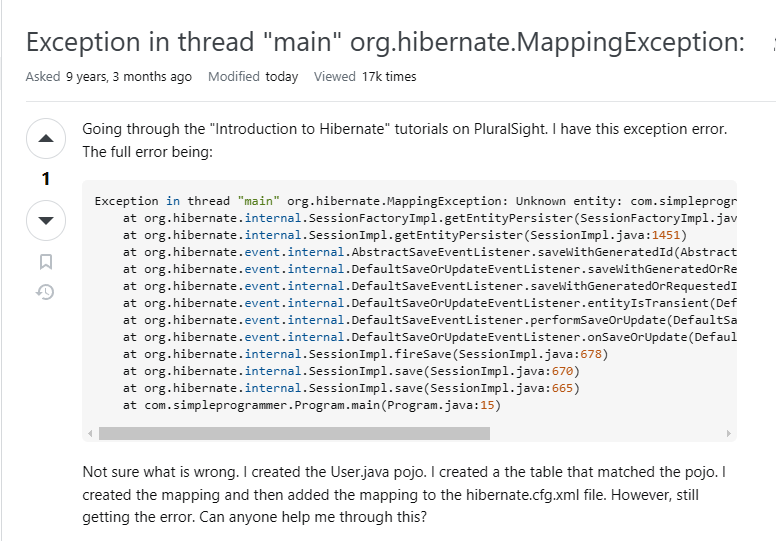

## The Importance of a Good Question

When programming, we inevitably encounter roadblocks—the number one source of frustration for developers. There have been a few times when I made a mistake in the foundation of my code, but only realized it after using the flawed code multiple times throughout the project. As a result, I had to painstakingly undo a lot of my progress. What makes roadblocks so unbearable is that they come in different forms: syntax bugs, logical errors, data mishandling, system incapabilities, and more. With the rise of AI, however, a decent amount of pain and suffering can be avoided—if and only if the roadblock is simple enough. Oftentimes, though, the problem can’t be solved with AI. From there, you’ll have to rely on other people for a solution, which is why it’s important to be able to construct a question that describes the issue and gets your point across. 

In my ICS 314 class, we’ve been taught how to ask smart questions. Smart questions are specific and contextual so that the reader can fully understand the problem even without access to your whole project or system. Another important aspect is demonstrating effort. Include the potential solutions you’ve already tried so that the reader, who is likely more knowledgeable, can better narrow down the issue. Asking smart questions greatly improves your chances of receiving timely and useful answers. While browsing StackOverflow, I found one example of a poorly-written question that went unanswered and another well-written question that received helpful responses.

## A Question That Lacks Context

<a href="https://stackoverflow.com/questions/79398853/ar-flutter-plugin-updated-assets-file-load-issue" target="_blank"><strong>StackOverflow Thread</strong></a>

This is an example of a poorly structured question. This user reports an issue they’re facing when they’re trying to use a certain library for an Augmented Reality project. However, they provide little to no context beyond the error message. The tags specify that they’re working on an Android application, but we have no idea if they’re testing on a physical device or emulator, which is an important detail that could impact troubleshooting. They also don’t include any code snippets, nor other console logs outside of that error message. A single error message, without supporting details, can mean many things, making it harder for others to assist. They also fail to mention any debugging steps they have already tried. Because of this, it can be assumed that they didn’t put in any effort to troubleshoot before posting. Including past troubleshooting efforts would help narrow down possible solutions and show that they’ve put in some effort before seeking help.

## A Well-Structured Question

<a href="https://stackoverflow.com/questions/33194384/exception-in-thread-main-org-hibernate-mappingexception-unknown-entity" target="_blank"><strong>StackOverflow Thread</strong></a>

Now here’s a great example of a smart question titled, “Exception in thread ‘main’ org.hibernate.MappingException: Unknown entity.” This user describes getting an exception error while following a tutorial on PluralSight, an online coding course. They provide the full console error message, a step-by-step breakdown of what led to the issue, and several code snippets from all of the relevant files. This is a polar opposite of the previous question.

Including the full error message is especially useful because it gives precise details about what went wrong at the system level, making it easier to pinpoint the problem. Furthermore, describing the task or goal of the program makes it clear to the responder what they are trying to accomplish and reduces the chances of being misled by an unrelated lead. Finally, by sharing all the related code, they allow others to see how the different files interact, making it easier to spot potential mistakes.

## It's About the Context

If you didn’t already notice, providing enough context is key. The more details you give, the better others can understand and solve the problem. A well-structured question saves time for both the asker and responder and increases the likelihood of success. Learning how to ask smart questions is an essential skill for any programmer, as it not only helps with debugging but also improves overall communication in technical discussions. In the end, programming is problem-solving, and asking the right questions is a crucial part of that process.

AI (ChatGPT) assisted in writing this essay by making the titles & headers, and improving transitions & flow.
