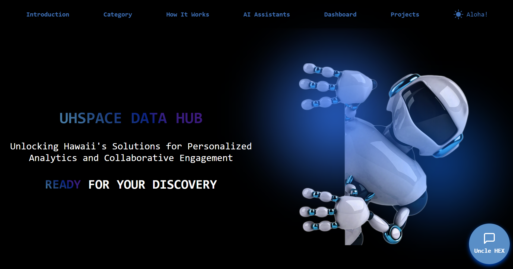

The HEX Open Data Portal was a project I worked on that won 2nd place at the 2024 Hawaii Annual Code Challenge. This project strengthened my UI skills and introduced me to backend management and AI training. It was implemented using Next.js, Firebase, Docker, and Flask.

We were given one month to improve the current [Hawaii Open Data Portal](https://opendata.hawaii.gov/) to be more organized, less clunky, and more user-friendly. We not only met the criteria, but innovated further with the implementation of graphs and charts for each dataset, an AI Chatbot that reads CSV files, and an interface for users to create and upload scientific reports for the world to see.

In this project, I was responsible with creating an admin portal with CRUD (Create, Read, Update, Delete) logic for seamless handling of the database and training the AI Chatbot using AI agents and prompts. 

The AI Chatbot, named Uncle HEX, is designed for users with a CSV file who need insights from the data. While training the AI, I implemented a two-pass generation technique for improving its responses. First, the AI generates an initial answer based on the user's prompt and CSV file. Then, it reprocesses the initial answer and refines it by applying external knowledge, such as historical events and trends, to provide deeper context and draw conclusions from it. This implementation was necessary as a workaround for our AI model's limitations on tokens.

Here is a simplified snippet of my double-pass implementation:

```
  ref = db.reference('AI')
  ai_data = ref.get()
  context = ""

  // Initial prompt with user input
  initial_analysis_prompt = (
    f"You are a data analyst. Analyze this dataset objectively, using only the information contained within it. "
    f"Here is the raw data content: {truncated_content}\n\n"
    f"User question: {user_input}"
  )

  // Generate initial analysis of CSV file
  initial_messages = [{"role": "user", "content": initial_analysis_prompt}]
  initial_completion = client.chat.completions.create(
    messages=initial_messages,
    model="llama-3.1-8b-instant",
  )
  initial_analysis = initial_completion.choices[0].message.content

  // Second prompt for enhancing the original analysis
  contextual_prompt = (
    f"Here is a pure data analysis of a dataset: {initial_analysis}\n"
    f"Now, enhance this analysis by:\n"
    f"1. Connecting it to relevant historical events or context when applicable\n"
    f"2. Explaining any significant patterns in layman's terms\n"
    ...
    f"User question: {user_input}\n"
  )

  // Generate refined analysis
  contextual_messages = [{"role": "user", "content": contextual_prompt}]
  contextual_completion = client.chat.completions.create(
    messages=contextual_messages,
    model="llama-3.1-8b-instant",
  )
  contextual_analysis = contextual_completion.choices[0].message.content

  // Format and return final response
  formatted_response = (
    "<strong>Uncle HEX's Insights:</strong><br>"
    + "".join([f"<br>{convert_markdown_to_html(line.strip())}<br>" for line in contextual_analysis.splitlines() if line.strip()])
  )

  return jsonify({'response': formatted_response})
```
 
Source: <a href="https://github.com/HACC2024/HEX">HACC2024/HEX</a>

You can check out the full project here: https://hex-hacc-2024.web.app/
