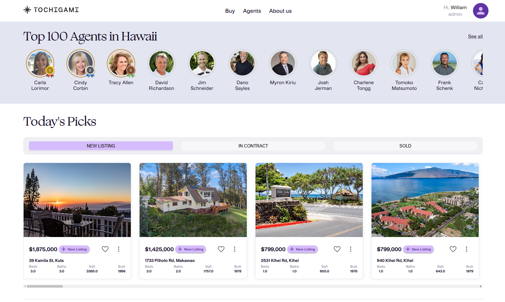

Tochigami is a real estate social media platform startup that allows for easy connection between homebuyers and real estate agents. The problem with currently-established big real estate sites like Zillow, Trulia, Realtor is that they profit off of gatekeeping agents' data and listings. Tochigami allows agents to have direct access to their data, exactly as it should be.

Built on Next.js, PostgreSQL, and Redis, this project has given me the opportunity to lead the completion of key frontend tasks. I've also been responsible for translating portions of Figma designs into code. Through this project, I've honed my skills in UI development and gained a lot of experience in full-stack integration, performance optimization, and building responsive, user-friendly interfaces.

I've worked closely with a team of developers and designers to improve the platform's features and make sure the user experience is smooth. This has helped me understand the full product development process, from idea to launch, while also improving my problem-solving skills and ability to work well in a fast-paced, team-oriented environment.

The project is still currently in development and has not launched. This page will be updated with the link at launch.
