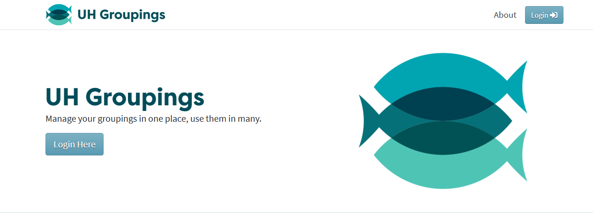

UH Groupings is a tool used by the University of Hawaii to manage groupings of people affiliated with the UH system. These groupings can be sorted by attributes like roles, campuses, majors, or more complex combinations. The purpose of organizing persons into groupings is to be able to give access to certain online resources and email lists.

During my time with Groupings, I primarily focused on frontend tasks, which included researching features, fixing bugs, and addressing errors. This project marked my introduction to web development and provided valuable experience with Jira, a widely-used ticketing system in the industry.

One of my tasks was preventing a preexisting race condition in an add function. I resolved this bug by adding a flag at the start of the function that'd return nothing if the function was already running, and flags before every other return statement disabling the mechanism.

Source: <a href="https://github.com/uhawaii-system-its-ti-iam/uh-groupings-ui">uhawaii-system-its-ti-iam/uh-groupings-ui</a>
